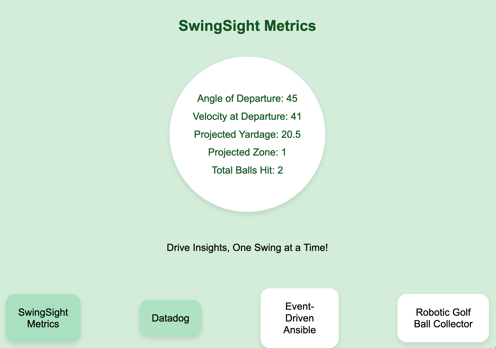
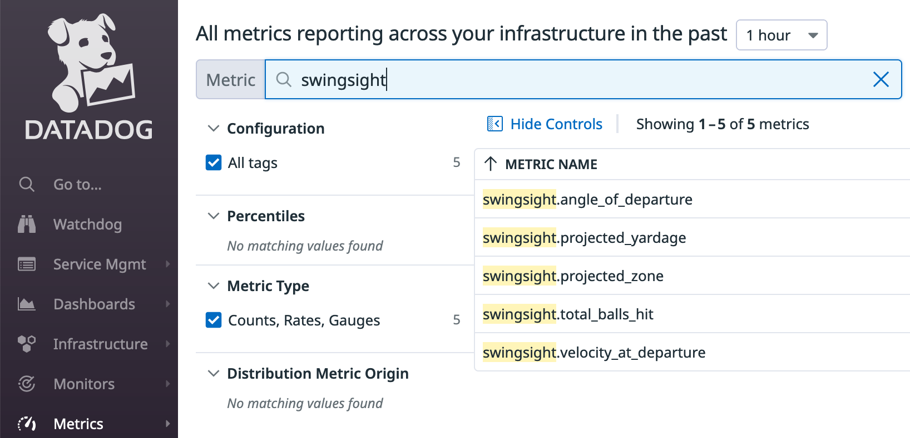

# SwingSight Metrics

SwingSight Metrics (`app.py`) is a Flask-based application designed to capture and analyze metrics from golf shots. It uses metrics such as angle of departure, velocity at departure, and then projects the yardage and landing zone of golf balls.



## Table of Contents

- [Installation](#installation)
- [Usage](#usage)
- [Datadog Integration](#datadog-integration)
- [Endpoints](#endpoints)
- [Contributing](#contributing)

## Installation

1. Clone the repository:

```
git clone <repository-url>
```

2. Install the required packages:

```
pip install flask requests
```

3. Ensure that Datadog Agent is running on your machine.

## Usage

To start the Flask application:

```
python <path-to-flask-app-file>
```

The application will start and listen on port 5000.

## Datadog Integration

SwingSight Metrics integrates with Datadog through a custom check. The custom check fetches metrics from the Flask application and sends them to Datadog. This allows for monitoring and alerting based on the metrics generated by the application:

- swingsight.angle_of_departure
- swingsight.velocity_at_departure
- swingsight.projected_yardage
- swingsight.projected_zone
- swingsight.total_balls_hit



To set up the Datadog check:

1. Place the `datadog/checks.d/swingsight_check` in the `checks.d` directory of the Datadog Agent.
2. Place `datadog/conf.d/swingsight_check.d` in the conf.d directory of the Datadog Agent.
3. Restart the Datadog Agent.

## Endpoints

- `POST /golfball-hit`: Accepts a JSON payload with `angle_of_departure` and `velocity_at_departure` to calculate and store the latest metrics.
    - `curl -X POST http://127.0.0.1:5000/golfball-hit -H "Content-Type: application/json" -d '{"angle_of_departure": 45, "velocity_at_departure": 41}'`
- `GET /swingsight`: Displays the latest metrics on a dashboard.
- `GET /clear-data`: Clears all stored metrics.
